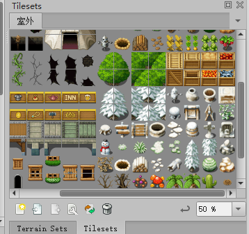
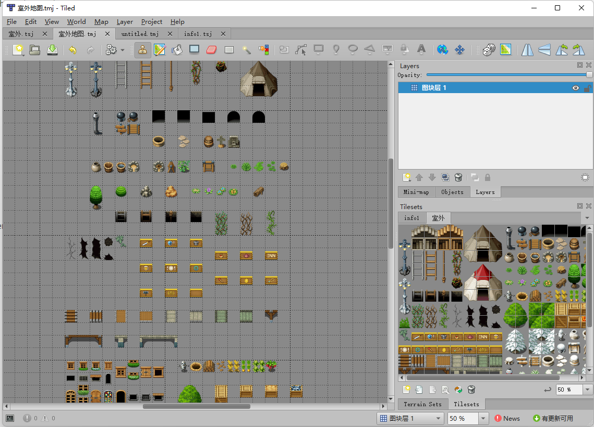
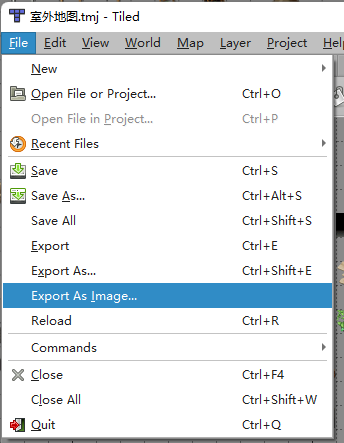
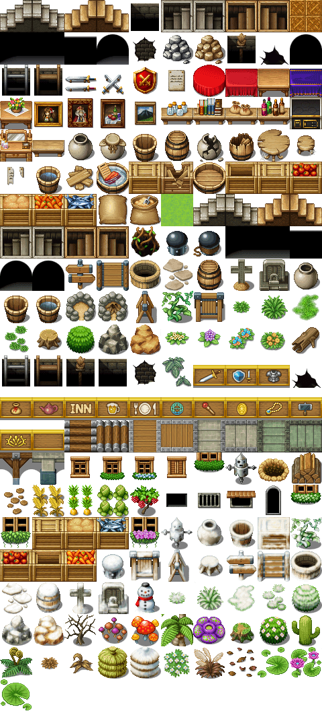
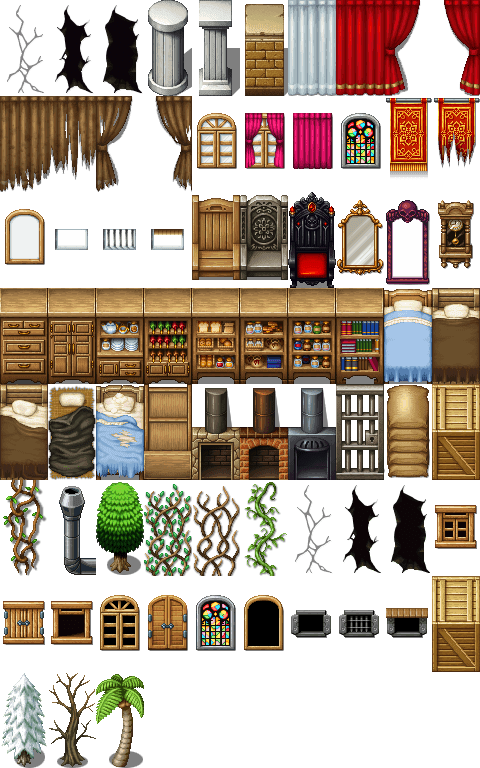
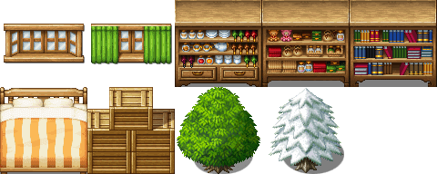
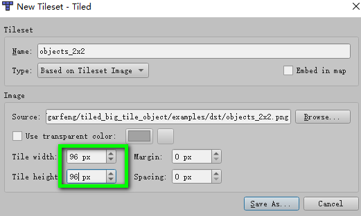
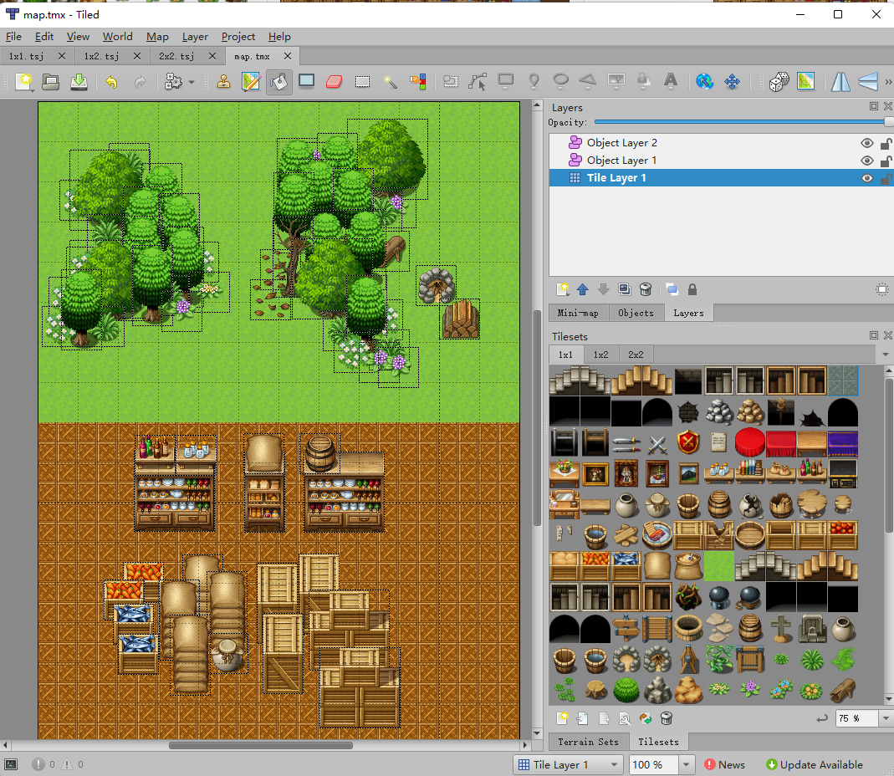

#  Generate Big Objects for Tiled

[中文版](translations/zh_cn.md) | [Download](https://github.com/garfeng/tiled_big_tile_object/releases)

There are some item with size more than 1 x 1. It is difficult to place them in map as `objects`.

Put them to a map (tile layer) separate from each other.

Export the map as Image.

Run this tool. It will group objects with same size to one image.

| objects_1x1.png                      | objects_1x2.png                      | objects_2x2.png                      |
| ------------------------------------ | ------------------------------------ | ------------------------------------ |
|  |  |  |

Then you could create new Tilesets in Tiled with their tile size.

Draw your map with then.  [Example maps](./examples).

