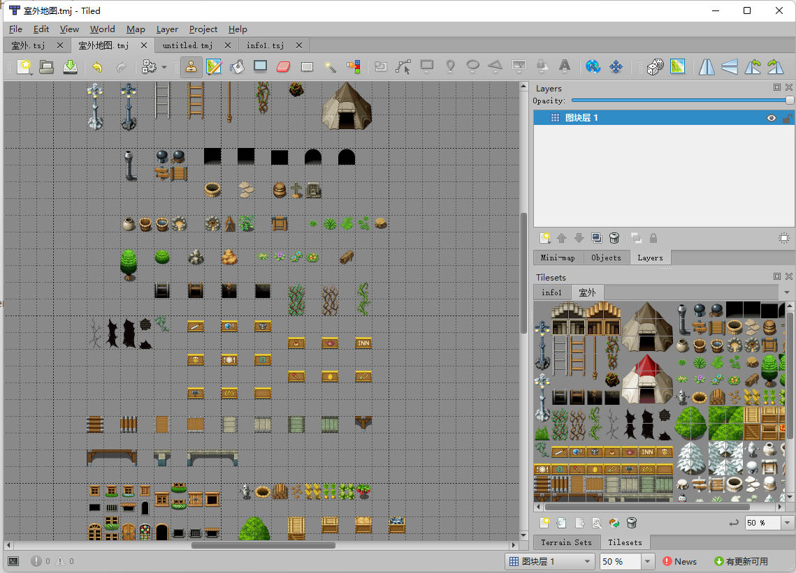
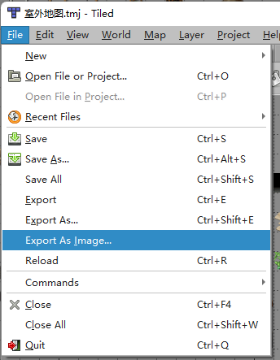
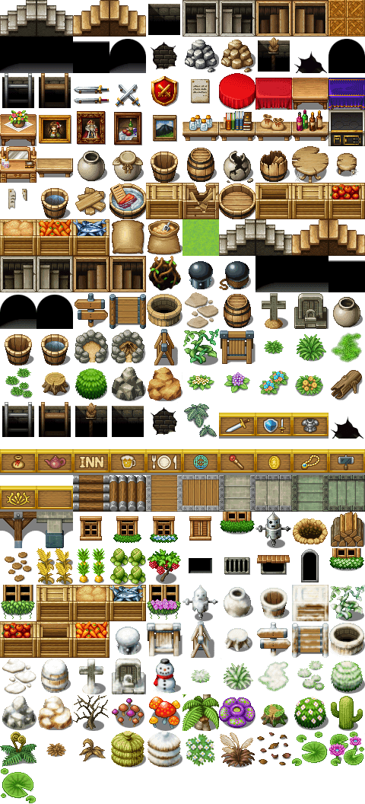
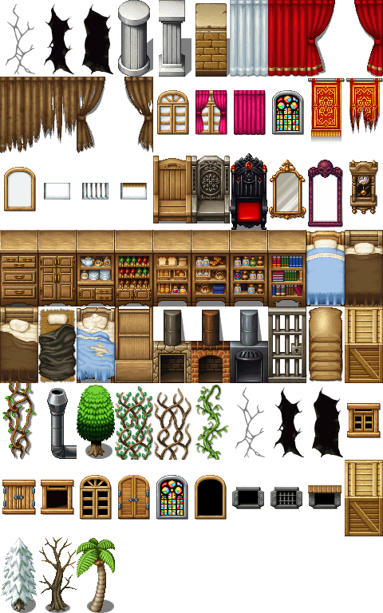
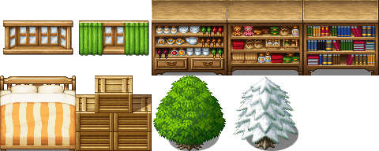

#  给 TildD 生成大的图块对象

[下载](https://github.com/garfeng/tiled_big_tile_object/releases)

地图图块中有一些东西大于1x1. 在TileD中无法轻松地将它们当作对象使用。

把它们绘制在地图中的图块层上。

导出为图像。

运行本工具，它会将尺寸相同的对象分到一组，分别绘制在一张图中。

| objects_1x1.png                      | objects_1x2.png                      | objects_2x2.png                      |
| ------------------------------------ | ------------------------------------ | ------------------------------------ |
|  |  |  |

然后你就能创建不同尺寸的图块。

在地图中方便地调用它们。  [范例地图](../examples).

